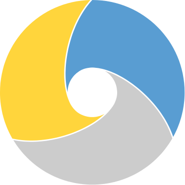

.. meta::
   :description: With the Python compiler Nuitka you create protected binaries out of your Python source code.
   :keywords: python,compiler,exe,binary,protection,portable,standalone,windows,linux,mac

############################
 Nuitka the Python Compiler
############################

****************
 What is Nuitka
****************

Nuitka is the optimizing Python compiler written in Python that creates executables that run without a separate installer. Data files can both be included or put alongside.

Nuitka is fully compatible with |SUPPORTED_PYTHONS|, works on **Windows**,
**macOS**, **Linux** and more—essentially, wherever Python is already compatible with your system.

.. raw:: html

   

      

         
A

         
IP Protection*

         
Secure your source code by not deploying it, protect your data files with deployment, avoid readable strings.

         
B

         
Performance

         
Speed up your program runtime and launch.

         
C

         
Deployment

         
Lorem Ipsum Lorem Ipsum Lorem Ipsum Lorem Ipsum

         
* for commercial users only

      

   

   

      
IP Protection

   

   

      
Performance

   

   

      
Deployment

   

Quick Demo
==========

.. asciinema:: ./casts/welcome-demo.cast

.. toctree::
   :hidden:
   :caption: Nuitka the Python Compiler

   Free Download <doc/download>
   User Documentation <user-documentation/index>
   Get Support <pages/support>
   Contribute <pages/contribute>

.. toctree::
   :hidden:
   :caption: Commercial Users

   |SHOPPING_CART_SYMBOL| Purchase Now <commercial/purchase>
   Commercial Features <doc/commercial>
   doc/bundles

.. toctree::
   :titlesonly:
   :hidden:
   :caption: News and Blog

   changelog/index
   Blog <news>
   Streaming <pages/Streaming>

.. toctree::
   :hidden:
   :caption: Other

   doc/Credits
   pages/impressum
   pages/pyside2
   pages/pyqt5

.. include:: variables.inc
