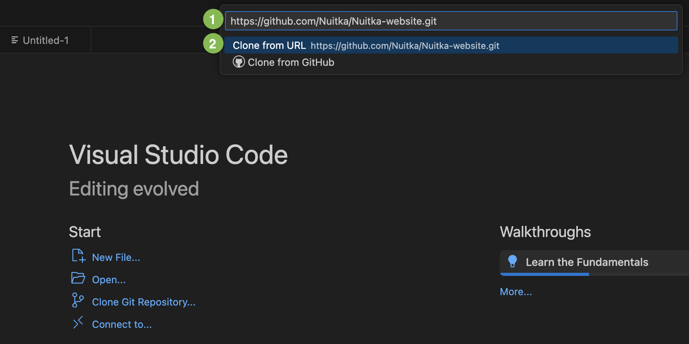

################
 Nuitka Website
################

********
 Introduction
********

Welcome to the **Nuitka Contribution Manual**! Your input is highly valued, and your efforts can enhance the overall quality of our documentation. Please follow the guidelines below for a smooth contribution process.

*******
 Dev Container Usage
*******

Learn how to efficiently contribute to the **Nuitka** website using **Visual Studio Code** and **Dev containers**. You will be amazed at how easy it actually is to contribute changes in this way. There is a manual way for advanced users described below in the **Manual way** section.

Before You Start
=========

#. Download and install **Docker** using the `Docker website <https://www.docker.com/products/docker-desktop/>`_.

#. Download and install **Git** on your computer. For doing that, select one of the following ways:

    - For Mac: Download **Xcode** using `App Store <https://apps.apple.com/ua/app/xcode/id497799835?l=uk&mt=12>`_.
    - For Windows: go to the `Git for Windowns <https://git-scm.com/download/win>`_ page, and then in the page, select **Click here to download**. Then, install **Git** by accepting the default settings.
    - For Linux: go to the `Git for Linux <https://git-scm.com/download/linux>`_ page, and then select the needed option based on your Linux distribution.

#. Sign up on `GitHub <https://github.com>`_. An account on **GitHub** is free and allows you to submit your changes to the repository. For more, see the `Sign-up instructions <https://docs.github.com/en/get-started/quickstart/creating-an-account-on-github>`_.

#. Download and install **Visual Studio Code**. Go to the `Visual Studio Code website <https://code.visualstudio.com/>`_, and then select the **Download** button, which is universal for all the operating systems.

Getting Started
=========

#. Open **Visual Studio Code**, and then, on the **Welcome** page, select **Clone Git Repository**.

    .. image:: ../../images/select-clone-git-repo.png
       :alt: The screenshot of the GitHub Welcome page with the Clone Git Repository feature highlighted
       :width: 600px

   .. note::

      Cloning is a term used in version control, meaning you create a
      local copy of a central repository and git is a tool used for it.
      Do not worry much about those things, Visual Code hides it away
      from you largely.

#. In the **Provide repository url** box (1), paste the following link: ``https://github.com/Nuitka/Nuitka-website.git``, and then select **Clone from URL** (2).

#. Then, you will see the description of the repo, and you confirm a target folder, where you create a folder names "Nuitka-website.git", it then asks if you want to open it, and yeah, you want to do that. It will also ask if you trust the authors, and you can accept that. It then will be able to do more convenience things for you.

   Once you do that, it prompts you "Folder Contains a Dev Container
   configuration file" and suggests to re-open. This is on a timeout,
   after a minute, this goes away. Say yes, or re-open the project in
   Visual Code.

#. Container start

   When starting, what it will do is to download a small container image
   of Ubuntu, which is a popular Linux from Microsoft server and run a
   few commands to customize the image, and become able to build and
   render the pages of the web site.

   .. note::

      Do not worry, that this is Linux, you won't have to notice or do
      anything different at all. The container image is automated and
      Visual Code will deal with git for you.

   After some time, it will prompt you to open a localhost (your
   machine) 8080 port browser window in your standard browser, and you
   can use it to navigate the website. Everything but the shop parts
   will work, since these are not included in the repo, and secret
   (using private keys).

#. Making your change.

   Once you edit a page, e.g. ``doc/index.rst`` what happens is that a
   launches a rebuild of the website each time you modify. If you happen
   to have a browser open with that page, once it completes it will
   reload.

   Some kinds of changes, e.g. to the CSS theme, or if you change what
   JavaScript is included, may require a relaunch. You then use the
   command "Dev Container: Rebuild container" and then it takes a short
   moment, and is fully fresh again. For normal page edits of the
   restructured text, no such issue exists.

#. Staging your change

   In the Visual Code there is a section "Source Control" where you may
   already know your way, but it will display the list of changes you
   made. What you do here, is to create commits. You add changes, and
   can look at the difference, by clicking them, which opens new
   windows. The staged parts then can be added with a message. You see
   that there is an indication in your bottom bar, if you have those.

#. Create a Pull Request.

   By selecting the command GitHug Pull Requests: Create Pull Request,
   visual code will guide you through the process of making a PR out of
   your pull request.

#. Communicate about your pull request. You will be informed of a URL,
   and it will be e.g. like this: TBD and once your change has been
   reviewed, you might get asked to make some changes to it, where you
   open the project and just make them. And update the pull request, or
   you get informed about the merge of it.

#. Success.

   None of this is strictly difficult. You almost have a bit of "what
   you see is what you get" editing, but the website is text driven on
   purpose, such that collaboration on it is very easy, and that we can
   change to underlying tools easily.

Manual way
======

This is used to build the Nuitka web site. Enhancements of all kinds are
welcome. You will need python 3.10 and ``pipenv`` to build it.

.. code:: bash

   # Creates a virtualenv with all that is needed to develop the
   # site.
   python3 -m pip install -U invoke
   python3 -m invoke virtualenv

   # Now lets build the site, to see if it's all correct.
   python3 -m invoke doc

   # Optionally build the localized sites.
   python3 -m invoke intl -l zh_CN
   python3 -m invoke intl -l de_DE
   ...

   # Post processing, e.g. adds language switcher, compact
   # JS/CSS, adapts external links, and more.
   python3 -m invoke run -t post-process

   # Start local web server with the site, and do automatic
   # rebuilds. Localization are rebuilt if they were previously
   # built.
   python3 -m invoke run -t serve-site

   # Browse it (Linux)
   xdg-open http://localhost:8080
   # Browse it (Windows)
   explorer http://localhost:8080

*****************
 Usage of Sphinx
*****************

So the site is basically mostly an automation of importing a few files
from the Nuitka git repository, splitting up e.g. the ``Changelog.rst``
into pages, with otherwise using Sphinx to render it. Reference the
Sphinx documentation and esp. the one for Read the Docs theme and ABlog.

**************************
 Restructured Text (REST)
**************************

Restructured text is a format very similar to Markdown, which some of
you may already know, but with more features. You can check out the
syntax here.

https://www.sphinx-doc.org/en/master/usage/restructuredtext/basics.html

**************
 Sphinx Theme
**************

We are using the customization of "read the docs" things theme. We use
this

https://sphinx-rtd-theme.readthedocs.io/en/stable/configuring.html

The current configuration is in ``shared_conf.py`` and relatively empty,
we might want to explore and document our choices for some of these
options.

*****************
 Blog with ABlog
*****************

We are using a sphinx extension called ABlog that can create the RSS
feeds and pages of the Nuitka blog.

https://ablog.readthedocs.io/en/stable/manual/ablog-configuration-options.html

*************
 New posting
*************

Create the ``*.rst`` file similar to e.g. ``doc/letting-go-of-c11.rst``
and then execute this

*************
 Translation
*************

Translations of the Nuitka website are very welcome. We have a team for
those want to work on it, with push rights to the repository. Right now
a ``translation`` branch is used, but the plan is for it to be merged,
and to provide the infrastructure in the ``main`` branch.

Here is a table of the files to translate and their styles. Everything
that is not mentioned here, should be asked about if in doubt. Not all
pages make sense to translate.

.. important::

   Before translating, I would love you to also actually review the
   content, if you agree it makes sense, if it can be better structured.
   This is very much needed unfortunately.

.. note::

   There are plans to get rid of ``pages`` and ``doc`` sub-folders of
   the site folder ``doc``. For URLs, these are plain bad, and would
   e.g. be much better as ``python-compiler`` and the like. A plan will
   be devised and put into place, but it will just move and renamed
   pages.

Directory ``posts/``
====================

At this time, the blog posts, esp. old ones should not be translated. I
believe often new content will be created in post form, and then moved
over to pages for translation. A current example are tutorial style
pages including screenshots, which depending on how the e.g. Python
installer look in your language, Explorer and shell prompt, even
screenshots might have to be translated. This will come only later
though.

Page ``pages/donations.rst``
============================

Yes, please go ahead. Let me know if there is any need to hint Paypal,
or when Paypal is not available in your country, what alternative ways
we could use.

Page ``pages/overview.rst``
===========================

Please hold off from this one. It currently is just a duplicate of
content that is just the same in ``index.rst`` and not linked anywhere,
so please ignore it for now.

There is a plan to have a "feel good" cross road entry page, that will
lead to the kind of page, that the home page is right now.

Page ``pages/pyside2.rst``
==========================

Very important kind of page, of which I want to have more. Nuitka links
itself to this from the plugin, and it's a landing page to inform users
about troubles that can be expected. We want to have some boilerplate
for this, and a general way of adding these. These user hint pages are
where I think we ought to help the users from real Nuitka to find the
information, and even localized for their needs.

Page ``pages/support.rst``
==========================

This one is not mentioning the Discord server yet, I will add that soon
though. Very important page that should be linked to from many places.

Page ``pages/gsoc2019.rst``
===========================

This is historical information, translation makes no sense, not sure
what to do with it. But if Nuitka were to do it again, we would
translate it ideally for the next time.

Page ``pages/impressum.rst``
============================

This one is required by law in my country, translators might want to add
their information here. I cannot take responsibility for the content of
translations, as I cannot verify it in many cases.

Page ``pages/Presentations.rst``
================================

This one probably should get more love content wise. It's under
construction. I want to go over the blog and link all information from
there. But if you are aware of material in your language, please go
ahead and add it.

Page ``Streaming.rst``
======================

Since this about an English offer, not sure it makes sense, I will also
update it in near future somewhat, but making clear it's going to be an
English content, I think it ought to be translated on a basic level at
the beginning of the page, and then have untranslated content?

Page ``doc/api-doc.rst``
========================

Translation makes no sense and cannot be done currently anyway. The API
doc is going to be generated with Spinx, Doxygen docs are without love.

Page ``doc/commercial.rst`` and folder ``commercial``
=====================================================

Translation is very welcome. There will be more content added over time.
For payment options, please check out if they work for your country and
if not, help me find alternatives. I was e.g. rejected for AliPay in
China, but maybe other things can work. And Russia e.g. has no Paypal
(which I mean to add as an alternative still).

Page ``doc/factory.rst``
========================

Very useful to have it translated.

Page ``doc/welcome.rst``
========================

This is just a playground for me, do not translate, unless we want to
play around with translation mechanics. We will want to e.g. have an
intelligent language switcher at some point, and could try it out there.

Page ``doc/Changelog.rst``
==========================

Do not translate, this is a bizarre amount of work.

Page ``download.rst``
=====================

Very welcome, but beware that ``download.rst.j2`` is the real source.
Tables are generated into the document, this is probably a harder case
technically, so hold off until this is sorted out.

Page ``developer-manual.rst``
=============================

Makes no sense to translate. But potentially there is content that
belongs to user manual in there or should be split off.

Page ``roadmap.rst``
====================

Much like changelog, not as much work, but also not as important.

Page ``doc/user-manual.rst``
============================

This one is most important in my mind, optimization section needs a
serious update from my side, maybe ignore that, until I get there.
Review applies here very much. I think Tutorial parts might be factored
out to separate documents.

******************
 How to translate
******************

.. code:: bash

   # Generate the .pot files
   cd intl
   make gettext

   # Generate .po files from .pot
   sphinx-intl update -p ../output/gettext -l your_language_code

Under locales in the folder with the language code you will then have
many .po files. In the .po file you can see ``msgid`` and below it
``msgstr``. ``msgid`` contains the english original, in ``msgstr`` you
can write the translation. If you then want to transfer your changes via
PR, please commit **only** the files you have translated.

********************
 Image Optimization
********************

.. code:: bash

   # Optimize PNG files like this, normally not needed, this
   # is lossless.
   sudo apt-get install optipng
   find . -iname *.png -a -type f -exec optipng -o7 -zm1-9 {} \;

   # Optimize JPEG files like this, normally not needed, this
   # is lossless.
   sudo apt-get install jpegoptim
   find . -iname *.jpg -a -type f -exec jpegoptim {} \;
