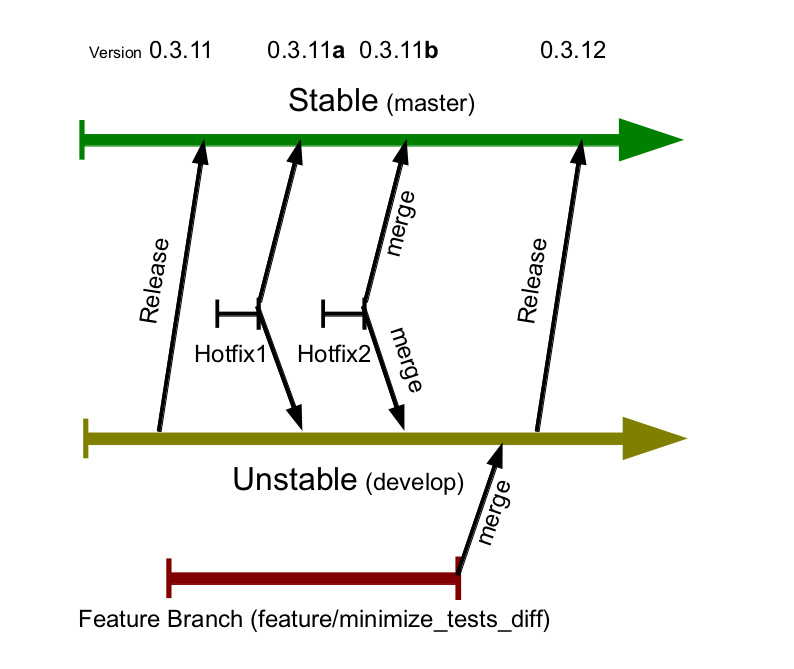

.. post:: 2011/10/01 08:37
   :tags: git, Nuitka, Python
   :author: Kay Hayen

#################
 Nuitka git-flow
#################

Hello there,

this is to let you know that I have switched `Nuitka
</pages/overview.html>`_ to the `"git flow"
<https://github.com/nvie/gitflow>`_ development model. That means, now
there is a supported stable version, and a develop branch, together with
feature branches.

*********
 Example
*********

   Git flow example for Nuitka release 0.3.12

.. Note::

   In case, you want and can improve the `source
   </posts/images/Nuitka-git-flow.odg>`_ visually or otherwise, please go
   ahead. I am using it for a presentation next week too, and would be
   glad if you could make it more pretty. My artistic skills are not the
   same as my programmer skills. :-)

So there is now always at least these 2 branches:

-  Stable `(master branch)
   <http://nuitka.net/gitweb/?p=Nuitka.git;a=shortlog;h=refs/heads/master>`_

-  Unstable `(develop branch)
   <http://nuitka.net/gitweb/?p=Nuitka.git;a=shortlog;h=refs/heads/develop>`_

and then there may be feature branches, like this one currently:

-  Feature branch `minimize_CPython26_tests_diff
   <http://nuitka.net/gitweb/?p=Nuitka.git;a=shortlog;h=refs/heads/feature/minimize_CPython26_tests_diff>`_

These will only have certain life, until they are completed, then they
are merge into "develop" and become part of the next release. This may
or may not happen, depending on how things go.

***************************
 Benefits of the new model
***************************

-  Hotfixes, typically bug fixes, can be made simultaneously on stable
   and develop branch. The git-flow package takes care of the merging to
   both.

-  Because that's so easy now, a stable version can be provided and
   supported for a longer time.

-  Features can be published while under development. My idea is that
   feature branches should basically work, but the bar will be lower.
   People can have a look at them, or start their own and make me
   integrate them.

************************
 Uses of Feature Branch
************************

For example, in the new feature branch, a couple of boring things are
happening. Support for frame stack will reduce the diff, as will some
work to match CPython's choices for exception line numbers. Completing
will take a while, but should not block a release. So this is best done
in the feature branch, esp. as nothing is going to really depend on it.

*****************
 General Picture
*****************

As you can see from this diagram, I am working mostly on documentation
things. The new and improved README on develop, which is closer to a
User Manual in PDF form, and other organization things, may get a
release before the PyCon DE next week. The README also describes this
process.

Hope is that with this approach, I will improve transparency (you can
see earlier what i am working on, because there is now a place where
things may break (develop) or may not yet be integrated or completed
fully (feature branches) and yet be public.

The overhead appears to minimal thanks to "git-flow". Developing
hotfixes is actually easier, when done on the stable branch, because
problems cannot originate from the current development work that may or
may not be all that perfect yet.

|  Yours,
|  Kay Hayen
